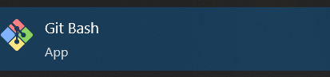

# Setting up the env
Make sure you have Git installed in you computer 
To verify just go to the windows icon in the left corner and type Git Bash 
You'll see something like this, open it. 

# Config the global username and email
 Navigate to the Documents folder by typing: `cd Documents`
 Create a new folder where you'll save all of your code: `mkdir webdev`
 Navigate to the created folder: `cd webdev`

 Configure the global username: `git config --global user.name "Your Github username"` 
 For example my username is florinda-jcoders so my command would look like this: `git config --global user.name "florinda-jcoders"`

 Configure the global email: `git config --gobal user.email "Your email associated with Github"`
 My example: `git config --global user.email "florinda@j-coders.com"` 

 To verify that was successful type in: `git config --list`
 And the console should display something like: 
 

# How to add your local project to Github
First navigate to the folder of your project, in our case this is in Documents/jcoders
Initialize the main branch: `git init -b main`
Add all the files to the repo: `git add .`
Commit the files: `git commit -m "First commit"`
Go to Github and create a repo, copy the HTTPS Url it should look something like this: https://github.com/florinda-jcoders/jcoders.git
We need to add this as our remote origin: `git remote add origin https://github.com/florinda-jcoders/jcoders.git`
Verify that is now your origin by typing: `git remote -v` and it should display the link. 
Now we push the changes: `git push origin main`